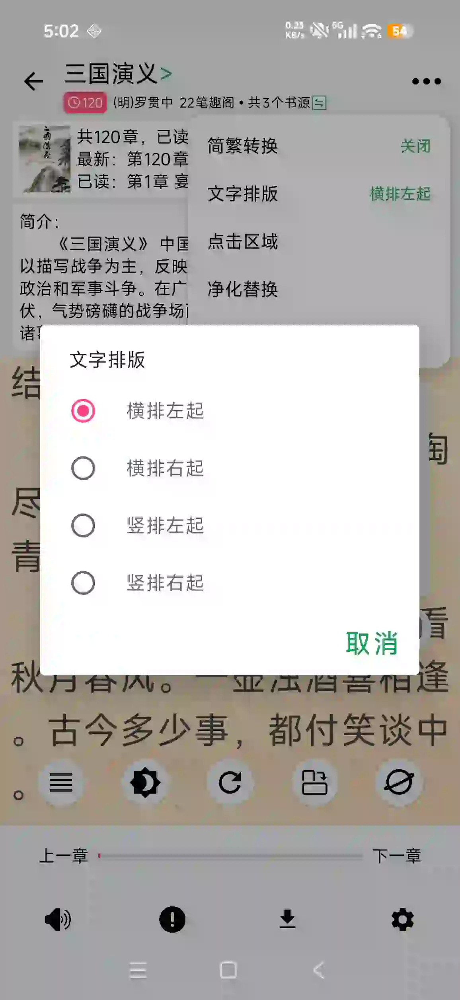

## 📕🤖老书虫自用网络小说阅读器；书源驱动，离线运行；Python书源；AI自动编写书源
## 如果喜欢就动动小手点个star，或者推荐给你的朋友吧😁😁😁😁
* 兼容阅读3.0书源规则
* 阅读页自定义背景、文字颜色、字间距、行间距、字体等等
* 内置净化规则模板

## [自定义书源](https://github.com/SJJ-dot/Reader/blob/BookSource/test/README.MD)

## 预览

|  |  |  |  |
|-----------------------------------------------------|-----------------------------------------------------|-----------------------------------------------------|-----------------------------------------------------|
|  |  |  |  |
|  |  |  |

## [下载体验](https://github.com/SJJ-dot/Reader/releases)

