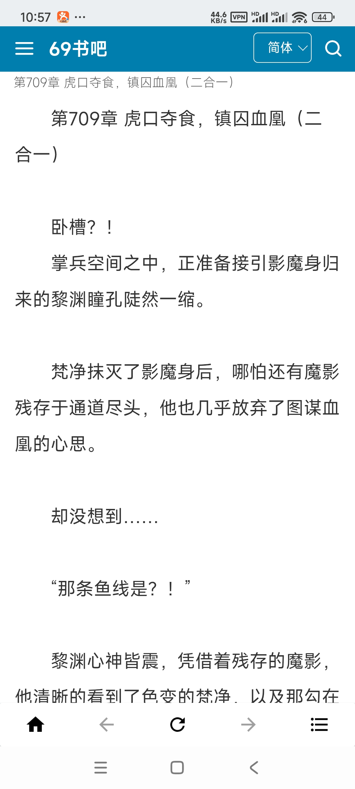
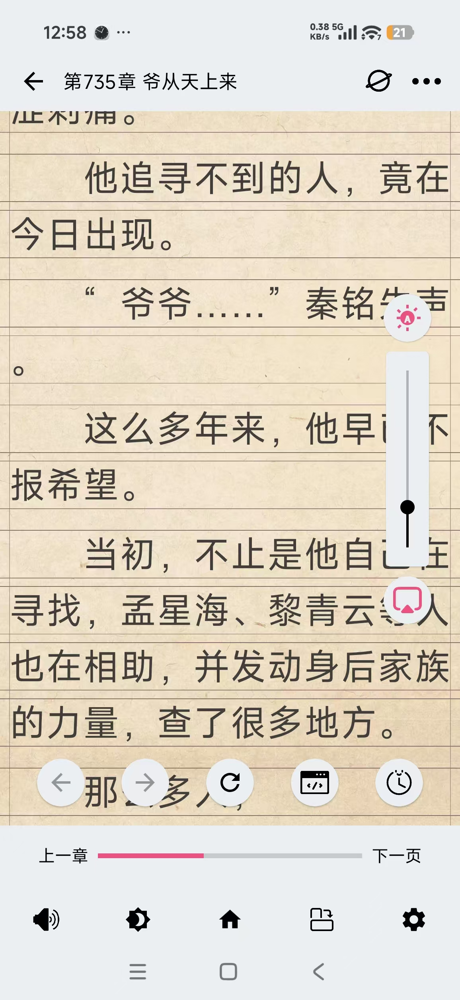
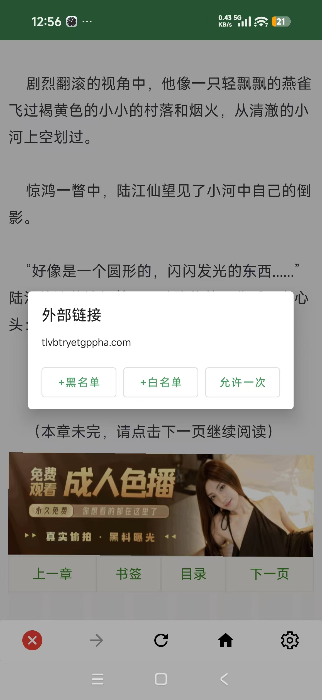
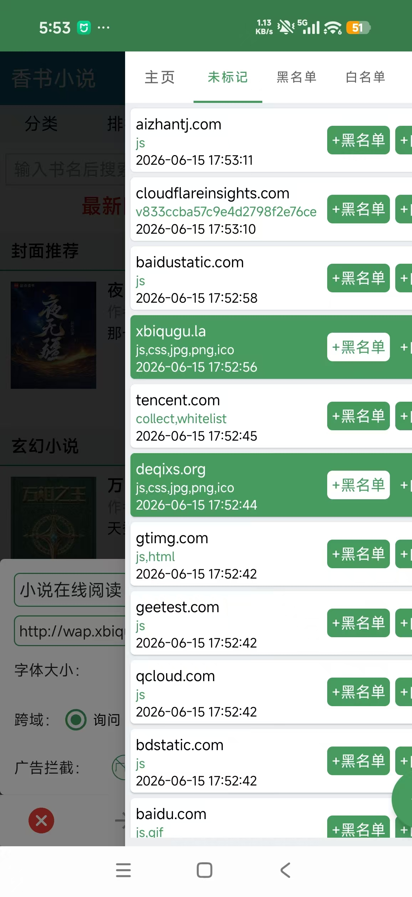
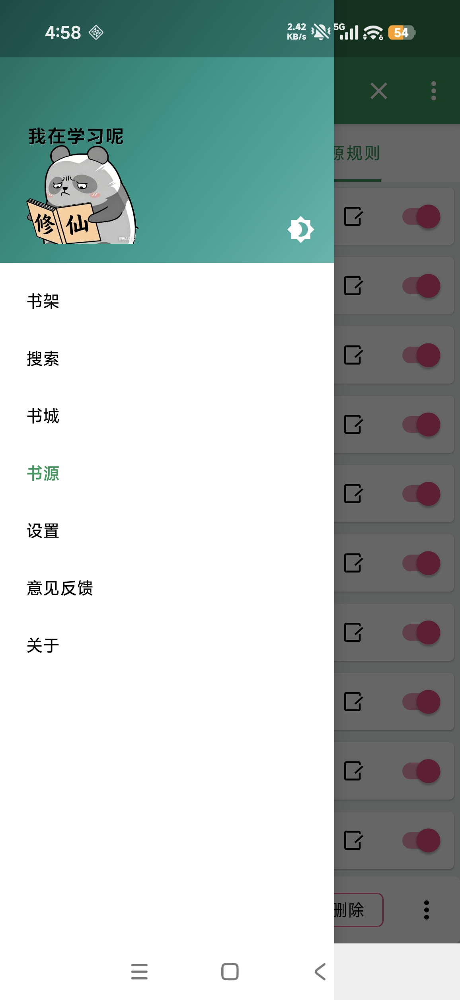
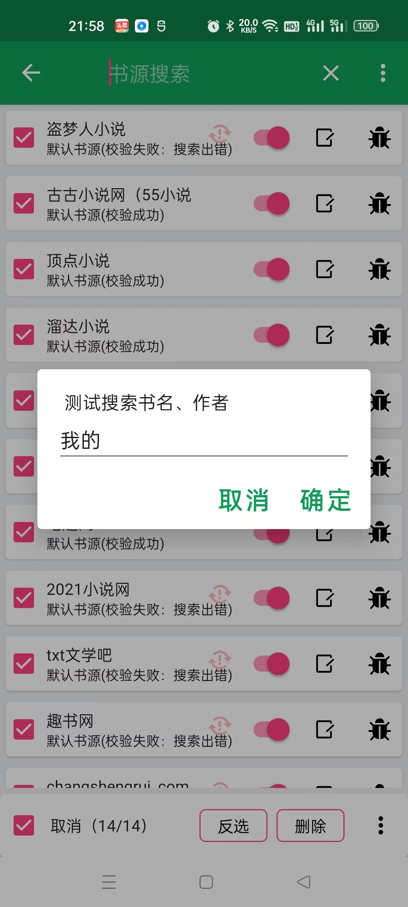
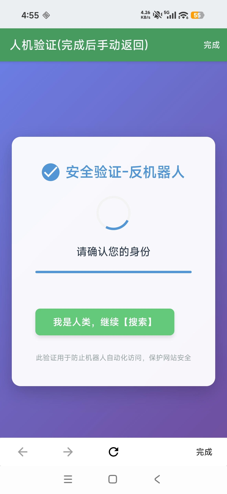
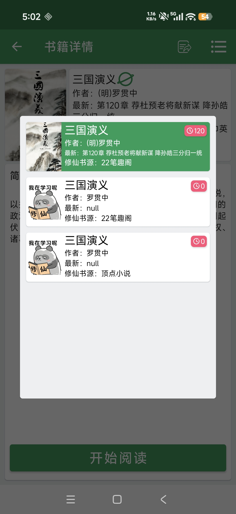
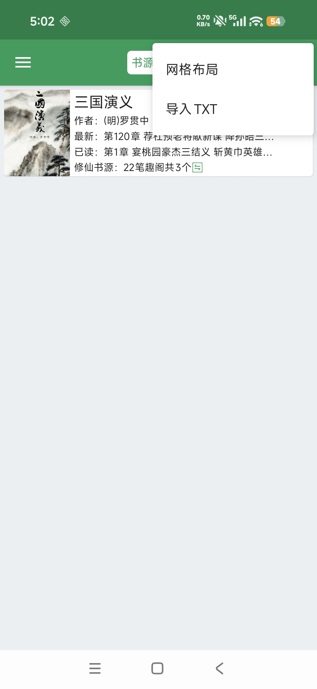
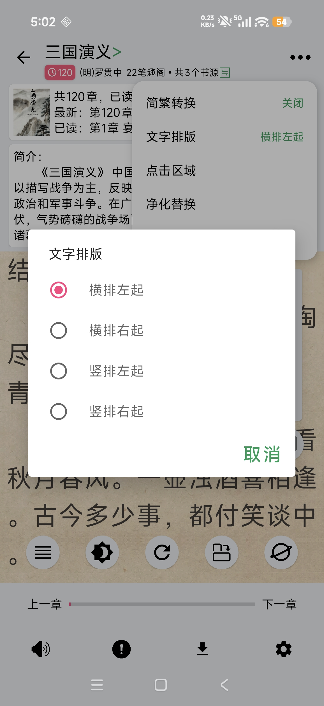

## 「修仙」是为学习和研究编程而开发的小说阅读器，严禁用于商业用途

* 书源支持：修仙书源、兼容阅读3.0书源规则
* 修仙书源使用Python编写可独立运行，相对于阅读3.0书源编写更简单，更方便使用AI辅助编写
* 浏览器阅读模式不依赖书源，可在书城将任意网页导入到网页书架，配合净化规则，可以获得几乎和书源小说相同的阅读体验

## 制作书源
- 如果不会编程也不会使用AI辅助编程，建议使用书源教程中附录的书源或者使用「`开源阅读`」的书源。
#### 书源接口介绍（`Python`）
```python
def verify():(可选)，不支持搜索功能时提供，避免验证书源失败
def getSiteUrl():(可选)，站点地址，直接导入书籍链接时用来匹配站点，书城`加书架`时匹配书源
def search(query):(可选)，搜索书籍，`search`和`getSiteUrl`至少需要一个否则书源即使导入也无法使用
def getDetails(url):(必选)，加载书籍详情信息和章节列表（重要）
def getChapterContent(url):(比选)，加载章节内容
```
#### 自定义书源
1. 模版选择：
    - 有人机验证选择[顶点小说](https://github.com/SJJ-dot/Reader/blob/BookSource/test/py/%E9%A1%B6%E7%82%B9%E5%B0%8F%E8%AF%B4.py)并打开APP设置页的测试接口，测试接口默认关闭，开启时可在局域网内调用APP内的人机验证接口
    - 无人机验证选择[小原文学网](https://github.com/SJJ-dot/Reader/blob/BookSource/test/py/%E5%B0%8F%E5%8E%9F%E6%96%87%E5%AD%A6%E7%BD%91.py)”。
2. 如果有`AI`，将对应站点网址给到`AI`，让`AI`根据模板修改即可；如果没有`AI`则需要配置`Python3.12`开发环境
3. 导入自定义书源
    - 单个书源可以在APP新建书源直接复制书源源码即可
    - 使用打包的脚本将书源压缩为ZIP放在`GitHub`使用`链接`导入或者`手机本地`直接导入`文件`
    - 例如本教程书源文件导入链接示例：https://raw.githubusercontent.com/SJJ-dot/Reader/refs/heads/BookSource/test/BookSource/default.json.gzip
    - 或者使用jsdelivr加速：https://cdn.jsdelivr.net/gh/SJJ-dot/Reader@BookSource/test/BookSource/default.json.gzip


## 如果喜欢就动动小手点个star吧😁😁😁😁

> 内置浏览器广告过滤、任意网站阅读模式

|  |  |  |  |
|-----------------------------------------------------|-----------------------------------------------------|-----------------------------------------------------|-----------------------------------------------------|

> 兼容阅读3.0书源规则、修仙书源

|  |  |  |  |
|----------------------------------------------------|----------------------------------------------------|----------------------------------------------------|----------------------------------------------------|
|  |  |  |

[Releases](https://github.com/SJJ-dot/Reader/releases)

## 下载体验


