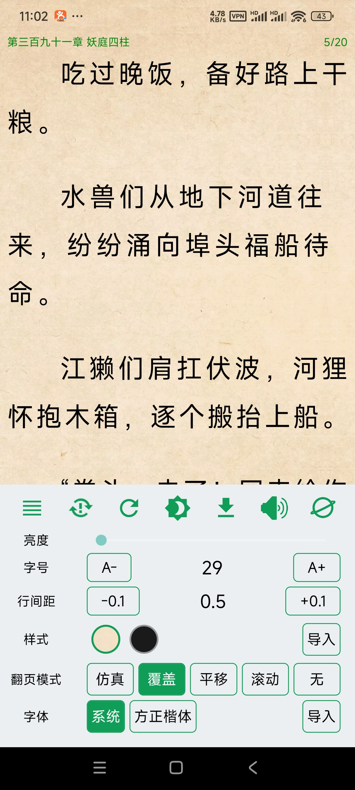
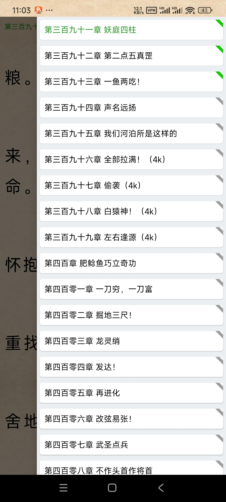
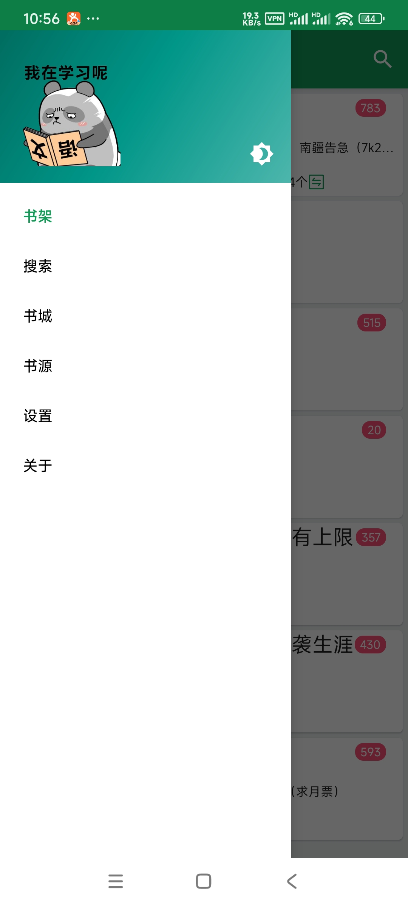
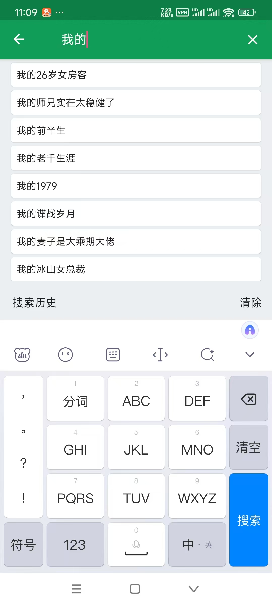

## 📖📖自用网络小说阅读器
## 如果喜欢就动动小手点个star吧😁😁😁😁

|  |  |
|------------------------------------------------------|------------------------------------------------------|
|   |   |
|   |   |
|   |   |
|   |  |

[历史版本更新说明](CHANGELOG.md)

[Releases](https://github.com/SJJ-dot/Reader/releases)

## 书源
* 书源语言支持：Python
* 推荐使用IntelliJ IDE、PyCharm 来进行书源编写，需要cookie的书源编写需要在手机安装APP后打开测试接口开关

