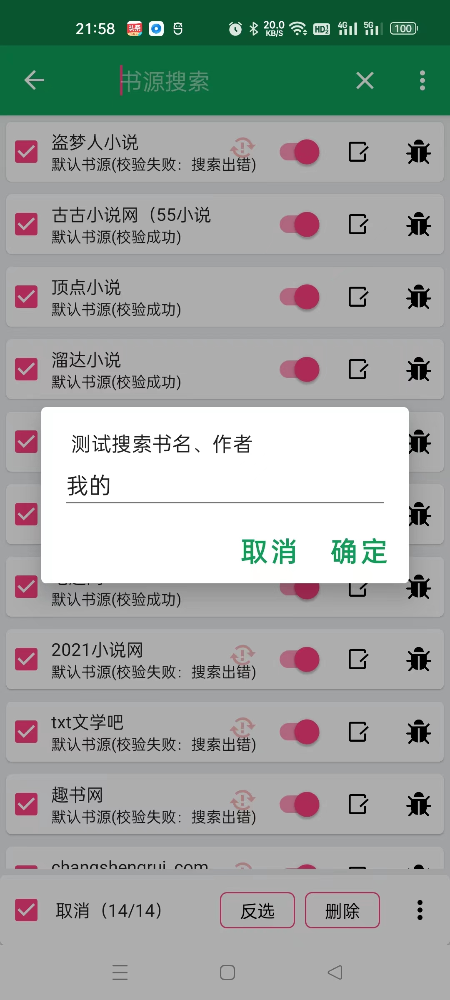
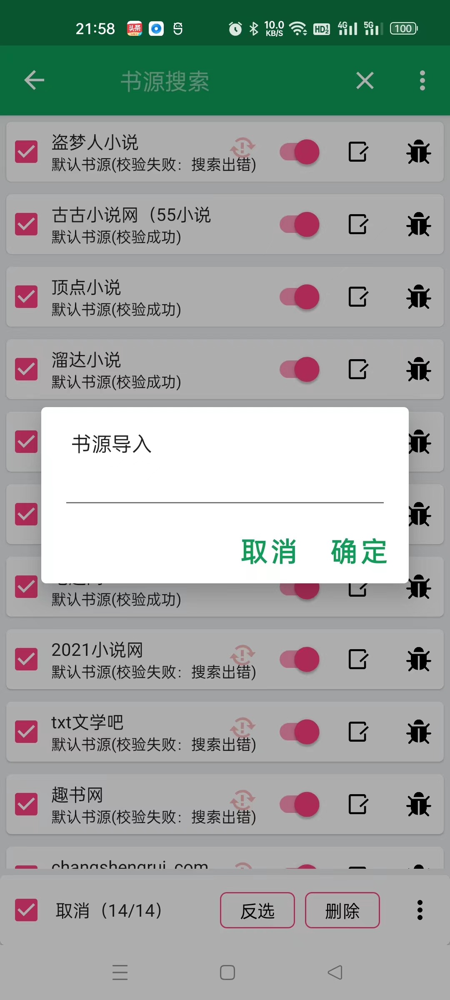
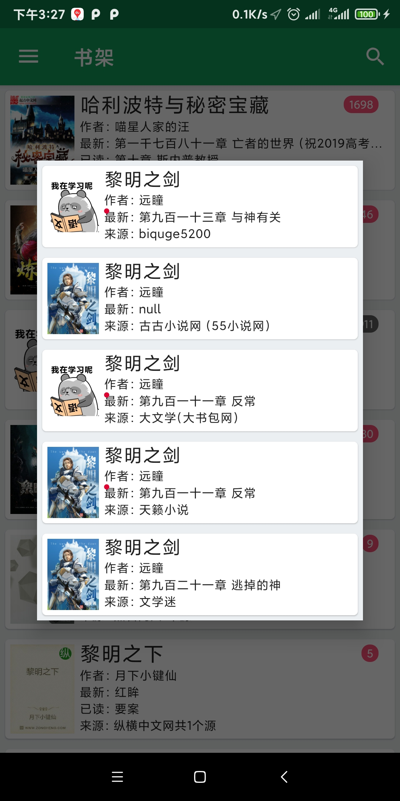

# 🚀😄android 小说阅读器(自用)，欢迎下载APK体验，持续更新中，支持自定义书源
# 如果喜欢就动动小手点个star吧😁😁😁😁
## kotlin 协程、rhino、Javascript、room

|         |    |    |
| - | - |- |

# 部分版本更新说明

## 1.4.1
阅读页两端对齐，优化文字选择性能

## 1.4.0
阅读页增加文字选择功能

## 1.3.2
书源切换体验优化

## 1.2.9
章节错误标记功能（追书的时候很有用）

## 1.2.5
增加仿真翻页等常规翻页模式

## 1.0.0
完善书源管理功能，支持导入自定义的网络书源

# APP下载 如果喜欢就动动小手点个star吧😁😁😁😁

[Releases版本可能不是最新的](https://github.com/SJJ-dot/Reader/releases)

[蒲公英扫码下载（最新）](https://www.pgyer.com/SJJ-dot-reader)

## 书源相关
* 推荐使用IntelliJ IDE 来进行书源编写
* 如果有好用的网站可以在issue提出

### 书源规则参考 

想要自制书源的朋友请参考书源模板，选择合适的模板复制改改就行。书源调试可使用test模块（test模块需要作为项目根目录直接打开），已设置好测试环境

[默认书源格式参考：https://github.com/SJJ-dot/Reader/blob/master/test/BookSource/default.json](test/BookSource/default.json)

[书源模板参考](test/src/main/java/com/sjianjun/test/templete)

## 感谢
非常感谢 [JetBrains](https://jb.gg/OpenSourceSupport) 提供的工具支持。
