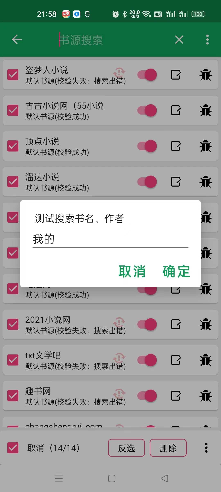
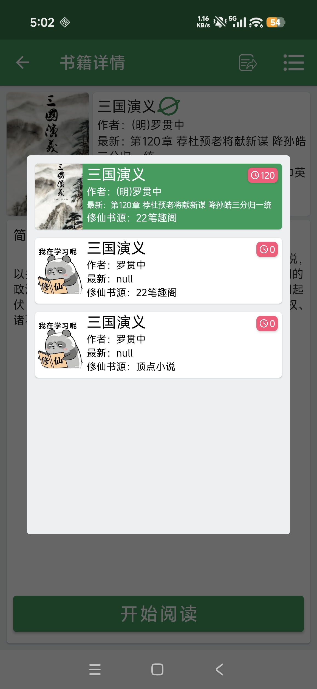
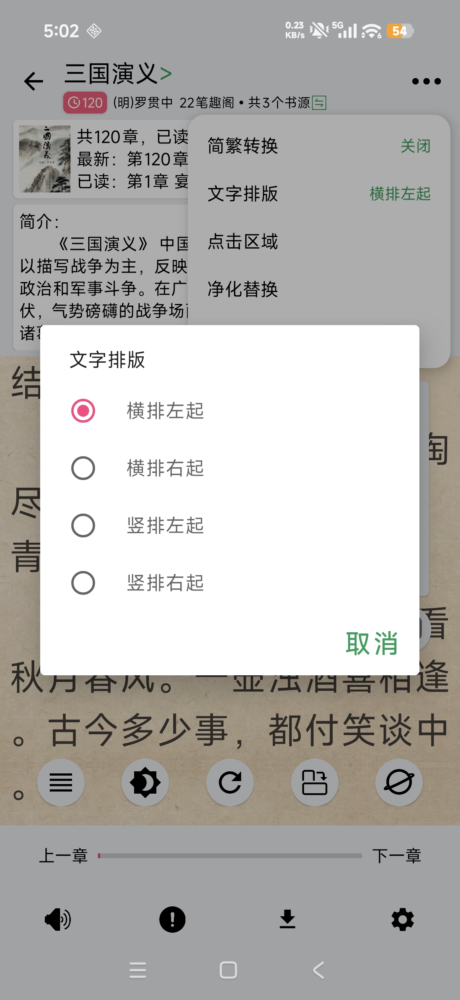
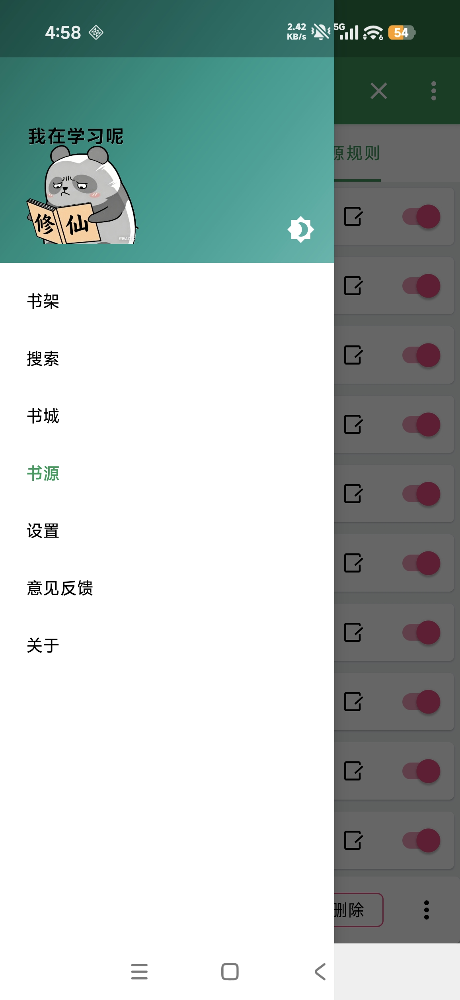
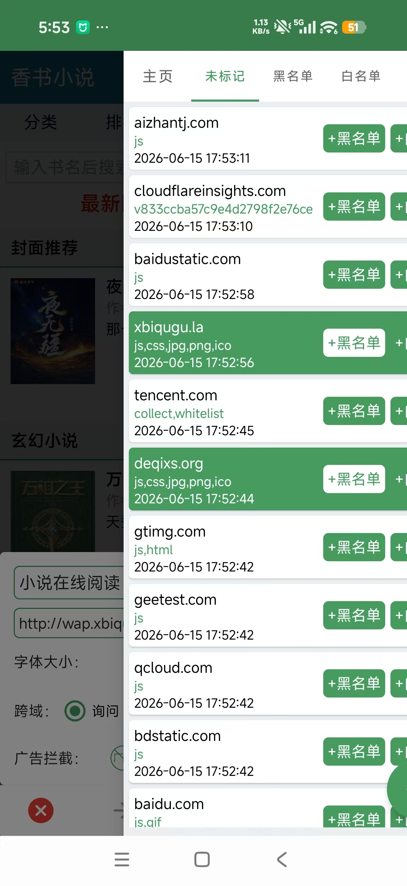

## 「修仙」是为学习和研究编程而开发的小说阅读器，严禁用于商业用途

## 下载体验

## 书源
* 书源支持：修仙书源、兼容阅读3.0书源规则
* 修仙书源使用Python编写可独立运行，相对于阅读3.0书源编写更简单，更方便使用AI辅助编写
* 推荐使用PyCharm来进行书源编写，需要cookie的书源编写需要在手机安装APP后打开测试接口开关
* [书源制作教程](https://github.com/SJJ-dot/Reader/blob/BookSource/test/README.MD)
## 如果喜欢就动动小手点个star吧😁😁😁😁

|  |  |  |
|-----------------------------------------------------|-----------------------------------------------------|-----------------------------------------------------|
|  |  |  |
|  |  |  |

[Releases](https://github.com/SJJ-dot/Reader/releases)
